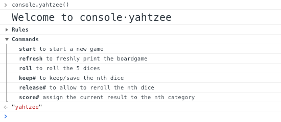
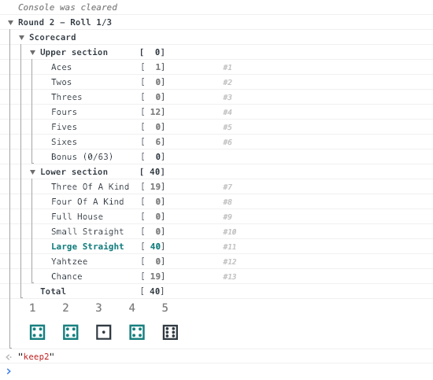

# console.yahtzee

text-based Yahtzee dice game using Google Chrome / Mozilla Firefox console






## Usage

1. open the developer console
2. type `console.yahtzee()` in the console prompt
3. follow the instructions to start a new game


## Build

To run in development mode

```sh
  npm run dev
```

To run in production mode

```sh
  npm run build
```


## License

MIT
